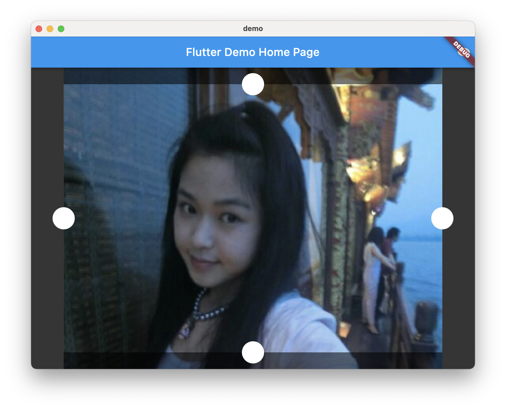
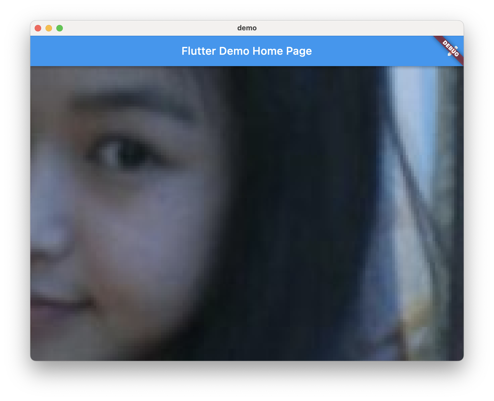

# image_crop_widget

an image crop widget implemented by flutter.

support scale image and crop a rect of this image.

you can try it [here](https://jinguoliang.github.io/flutter_image_crop_widget-/)

### 裁切模式

### 查看模式（仅支持缩放，移动）

